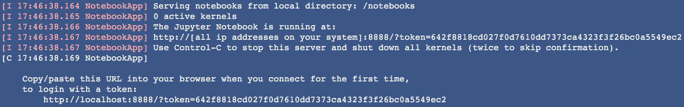

# Keras TensorFlow Model Example

Easy Keras Model with TensorFlow and Jupyter Notebook


## Download Image + Stand Up Container + Start Jupyter Notebook Server
```bash
docker run -it -p 8888:8888 macgyvertechnology/tensorflow-keras-jupyter
```

This command will output a hyperlink where you can find your jupter notebook instance.

```
Copy/paste this URL into your browser when you connect for the first time,
    to login with a token:
        http://localhost:8888/?token=642f8818cd027f0d7610dd7373ca4323f3f26bc0a5549ec2
```




##More Information about Docker Image

[https://hub.docker.com/r/macgyvertechnology/tensorflow-keras-jupyter/](https://hub.docker.com/r/macgyvertechnology/tensorflow-keras-jupyter/)


